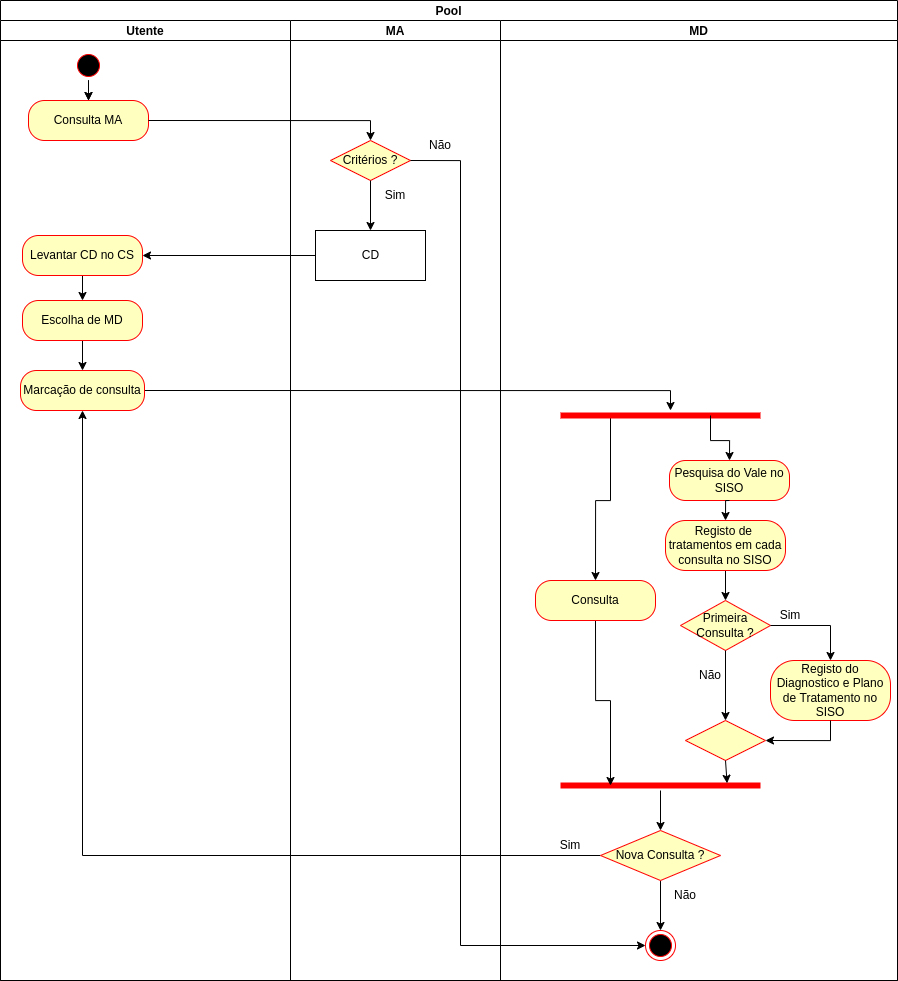
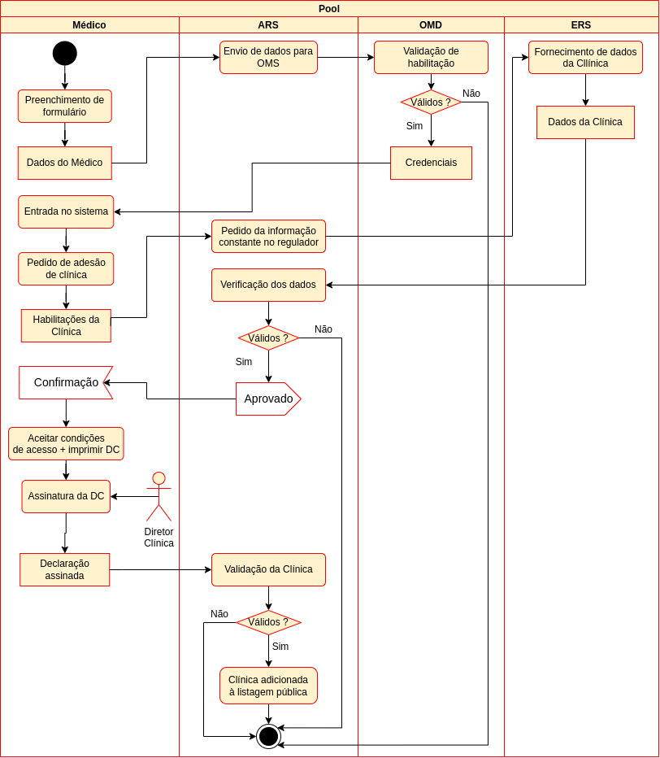
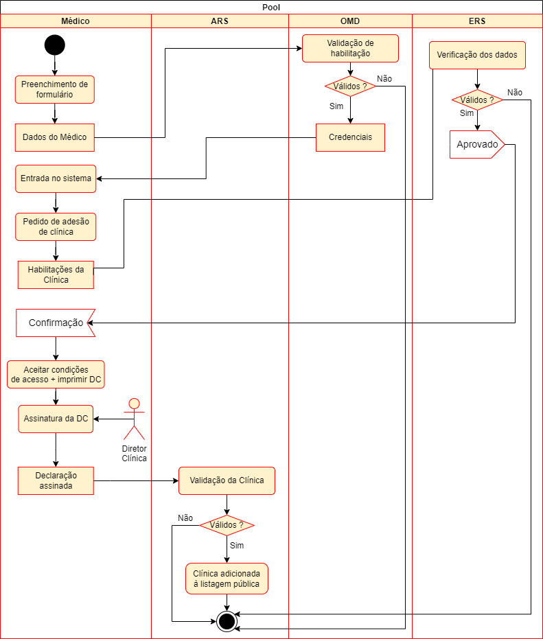
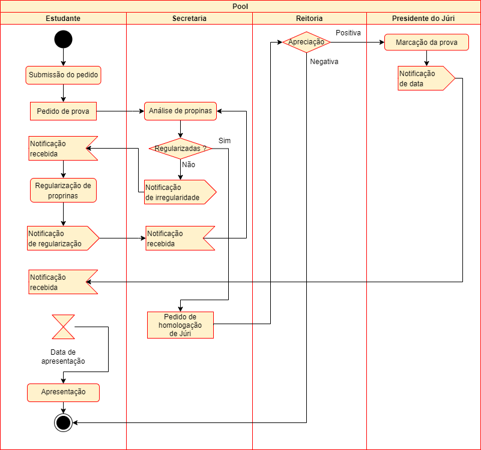

# Lab 1 - Process Modulation

## Group - **601**

|   Members                     | Mecanografic Number  |
|   :-                          |   :-:                |
| Daniel Capitão | 75943 |
| <u>David Ferreira</u> | 93444 |
| Samuel Teixeira | 103325 |
| Filipe Costa | 77548 |

## Exercise 1.1

At first glace, it appears to describes the process of placing and confirming a shipping order, and it follows the following flow:

1. The first action that takes place is the "Receive Order"
2. After the order is received, it can be accepted or not
    -  If accepted
        -   The order is filled.
        - By filling the order, two processes will take place simultaneously (represented by the fork node)
        - It will be given a shipping order
        - An invoice will be issued, and this object will be processed, and will result in it being accepted
        - Once the shipping order and the payment flow are complete, they will be joined and proceed the flow
    - If rejected
        - Nothing happens
3. Both flows, acceptance or rejection, will eventually merge.
4. After the, merge has take place, the order will be closed.
5. Once the order is close, the activity is ended.

## Exercise 1.2

## Exercise 1.3
### a)

### b)

The first step that can be improved about the present activity model, is to cut the "middle man" the accreditation of the doctor, by enabling the doctor's information to be directly sent to the Order.

The second improvement it to discard the paper methods and replace them by digital ones. It is time consuming to send the declarations in physical format, when it could be digitally signed and send by email.

Bellow there is a modulation of the improved activity flow.

### c)

For this cost analyzes, we assume that **every verification** has to retrieve information from somewhere, and soo each one will account for **30 mins**.

To add to that, taking the example of the real world, we know that passing information around multiple entities is time consuming, for that, we'll assume that every **transition of an object** between entities, **in digital format, like email**, incurs in an addition of **5 mins** to the total time of the activity.

Also, since the current model has one of the **transitions via physical format**, this adds a total of 2 days, witch we'll assume as **1440 minutes**.

Taking all this into account, the **total transition times** are:
- **Current model**
  - 1555 minutes.
- **Improved model**
  - 115 minutes.

## Exercise 1.4

