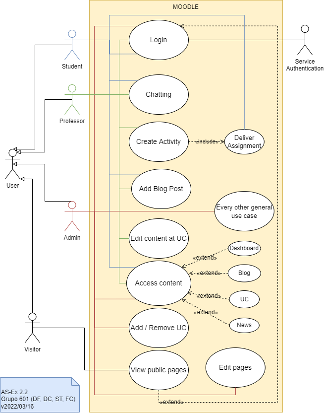
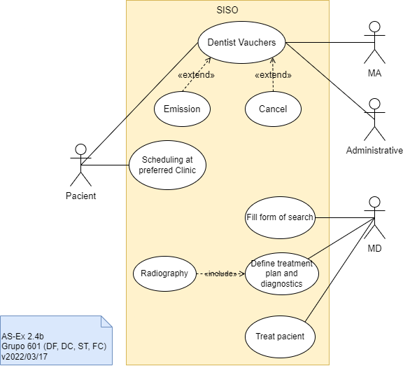
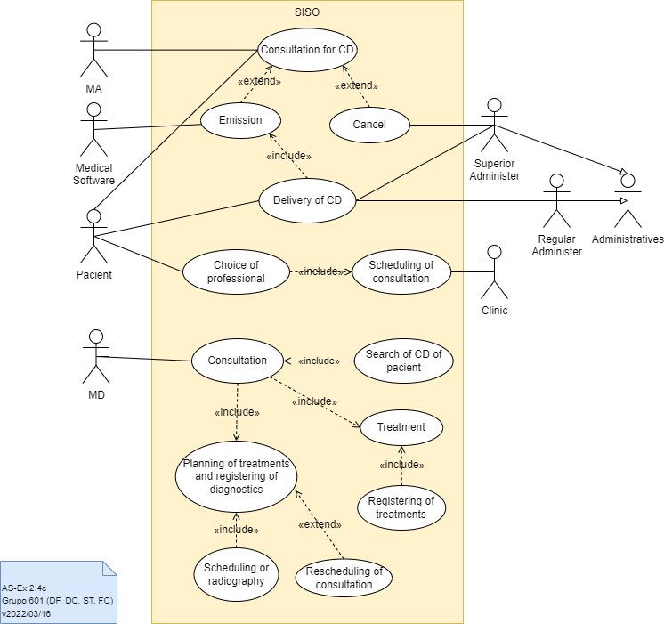

# Lab 02 - Process Modulation

## Group - **601**

|   Members                     | Mecanografic Number  |
|   :-                          |   :-:                |
| Daniel Capitão | 75943 |
| David Ferreira| 93444 |
| <u>Samuel Teixeira</u>  | 103325 |
| Filipe Costa | 77548 |

## Exercise 2.1

The diagram represents a **use case** modeling that describes the functioning of a system with the purpose of **purchasing items online**.

**Web customers** are divided into **registered customers** and **new customers**. New customers(visitors) can only view items and register in the system. The registration of the new customer is done by the **authentication service**, thus becoming a registered customer, allowing the viewing and purchase of items. Items and payment solutions at checkout are secured by the identity provider and duly authenticated in the system. Checkout can be done via **paypal** or **credit payment service**.

## Exercise 2.2
The diagram represents a **use case** modeling describing the interaction between different types of actors (users in this particular case), and the different levels of interaction that each one of this actors is capable of attaining in the Moodle system.

We can represente **four** types of actors, and each is a specialization of a general type actor, **user**:
- Students,
- Professors,
- Admins,
- Visitors.

Inside the system, there all multiple possibilities of interaction, the diagram only represents the ones that are relevant in a normal scenario, and does limits its representation to the biggest possible number of uses cases per actor, taking into account that since the **Admin** has full control over the system, it is unreasonable to show every single possible interaction of this actor, so there is a special use case that encases all those interactions.

For a **visitor**, only interactions with the **public pages**, beyond that is necessary to **login** to attain additional privileges.

For the **login** interaction, besides the user actor, a **external authentication service** will interact.

Once logged in, the three types of actors can, or cannot, interact in multiples use cases.

The **student** actor can interact with services like:
- Chatting,
- Assignment delivery,
- Adding a blog post,
- Access content in various places, like:
  - Dashboard,
  - Blog,
  - Curricular units,
  - News feed.

The **professor** actor can:
- Chat,
- Add a blog post,
- Access the general content,
- Create activities,
- Edit content inside a curricular unit,

The **admin**, of all previous interactions can only:
- Access content.

But other than that, can interact like:
- Add or remove curricular units,
- Edit pages,
- And every other backstage operation inside the system.

## Exercise 2.3 

|Use Case:|**Assignment Delivery**|
| :- | :- |
|Version:|v18/03/2022|
|Brief Description |
The Student goes to the course webpage, then accesses the open activity and uploads the work with the format and period that the Professor configures.

|
|Pre-conditions:|
The Student has an active account

The UC is being teached on the current semester

The Student is associated to the UC with Student role.
|
|Post-Conditions|
The Activity is available for the student to review(except if a date for the end of the activity is configured).

|
|Base Flow:|
**1. Accessing Student page**

It starts when the Student accesses "My Elearning" page" to submit the assignment. The system verifies if the user's session is active. If necessary, the system redirects to the autentication page of the Central IdP. The IdP returns to the samn context with the user's profile.

**2.  Selecting UC** 

The system lists the active UCs of the current Student on the entrance page, prominently. The Student selects the intended UC. The system introduces the entrance page of the UC with option panels to manage the page. If the UC is configured in weekly mode, the system must position itself in the current week, by default.

**3. Assignment submission**

The Student selects the assignment he wants to deliver and chooses the option/symbol to submit assignment placed in that area. The computer opens a file exploration system for the student to browse until he finds the file to be attached.

**4.  Configure submission parameters**

The Student provides a title for the attachment (work files). 

The system proposes default values for the work author.

The Student can also select the type of license they want.

**5.  Confirm Submission.**

The Student confirms submission of the assignment.

The system highlights timed submission, activity closed, invalid format, excessive file size, or any type of problem associated with parameters defined by the UC admin or professor, marking the background with a warning color.

The system displays the UC main page, positioned in the place where the activity is. 
|
|Alternative flows:|
**Step 1: Student is not in this UC**

The system verifies that the student does not belong to the UC and displays an error message. The navigation returns to the user's home page. 

**FA3a: Removal of Assignment Submition**

The Student can, after submit the assignment, remove it by choosing the option/symbol available for the student in the delivery area of the activity.

**FA3b: Re-Submission of the Assignment**

The Student can, after submiting the assignment, re-send a new version of it by choosing the option/symbol available for the student in the activity delivery zone.

**FA3c: Comments.**

The student can add comments after and during the submission of the work.
|
|Exceptions:|
**Ex1: Authentication system unavailable**

**Ex2: Student is not in this UC**

|
|Special requirements:|
[Usability] Free text fields must support hypermedia text, inserted with the support of a *widget* with options for formatting the text and placing hyperlinks.

[Usability] The file system submission supports *drag-and-drop* to the page.

[Performance] Authentication with the IdP must respond in less than 2 sec. 

## Exercise 2.4

### a)

Bellow, a list of every use case found, later implemented in the Diagram.

- **Consultation** for the Dentist Vaucher(**CD**).
-  **Emission** of the CD.
-  **Cancelation** of the CD.
-  **Delivery** of the CD.
-  **Choice of professional** by the paciente.
-  **Schedulling of consultation**.
-  **Consultation** with the MD.
-  **Search of CD of pacient** by the MD.
-  **Treatment**.
-  **Planning of treatment and registering of diagnostics**.
-  **Reschedulling of consultation**.
-  **Schedulling of radiography**.

### b)

The analyses of the Diagram 1 is in a form of comparison with the one created and displayed before, assuming the one created by the team is correct, we can point out some incorrectness in the one provided in the assignment. This being said, the corrected version of the Diagram 1, will be base on the Diagram of the previous point.

Other problem is the *Utilizar* use caso, wich is not an non option for the **CD** since this to be provided to the **MD (Dentist)** in a later phase.

The fact that the **Medial Softaware** actor, wich is essential for the emission of the CD, by communicating it directly to the **SISO system**, is not represented in the Diagram 1, is another incorrecteness.

The use case of *Assinar o CD em papel* is a specification of an action and not of an intention of the actor, **wich is incorrect**.

A **over specification** can also be pointed to the **included use case** *Selecionar o dente do odontograma*. This does adds no relevant information to the Diagram 1 since it's specific to the operation and work of the medical specialist and not relevant to the **SISO system**.

The fact that an important **use case** like the **rescheduling of an new appointement** is not represented, as a **crucial piece of information relevant to the function of the overall system**, is considered to be a **major flaw**.

### c)

