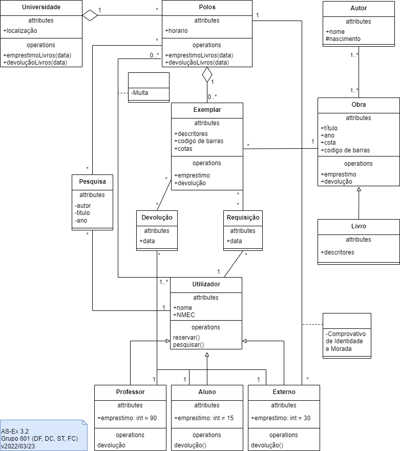
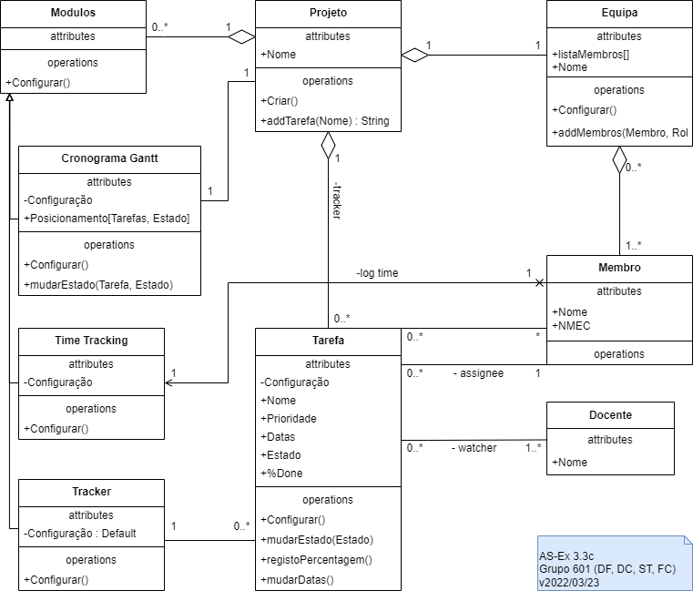
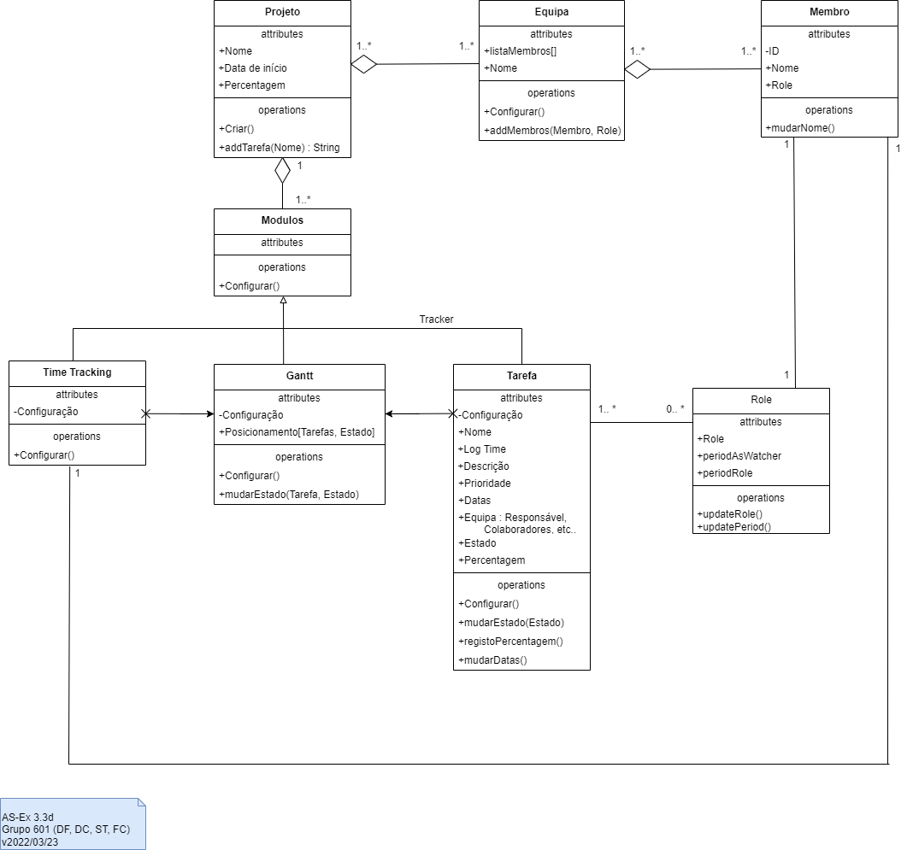

# Lab 03 - Modelação com Classes

## Grupo - **601**

|   Membros                     | Número Mecanográfico  |
|   :-                          |   :-:                |
| Daniel Capitão | 75943 |
| David Ferreira | 93444 |
| Samuel Teixeira | 103325 |
| <u>Filipe Costa</u> | 77548 |

## Exercício 3.1

**A)** V

**B)** V

**C)** F - A entrega/submissão é feita por uma equipa.

**D)** F - Uma submissão pode ser avaliadas por vários Membros CC e vários Membros CC podem avaliar uma submissão.

**E)** F - Uma equipa pode ser composta por vários alunos, mas pode apenas pertencer a uma instituição.

**F)** F - Apenas a submissão está limitada a uma linguagem.

**G)** F - Não existe uma definição para capitão de equipa no diagrama.

**H)** V - Se Membro CC se puder definir como docente.

 

## Exercício 3.2

## Exercício 3.3

### a)

| Conceito candidato | Atributos candidatos |
| - | - |
| Projeto | Titulo   Data início   %Done   Tarefas (Issues)|
| Tarefa | Descrição   Prioridade   Data inicio e fim   %Done   Estado   Assignee (Responsável)   Watchers |
| Equipa | Nome   Membros |
| Membros | ID   Nome|

### b)

| Categoria conceptual | Conceito identificado (domínio da gestão de projetos) |
| - | - |
| Transações comerciais  | Tarefa (assumindo que os recursos têm custos ) |
| Produto ou serviço relacionado transacionado | Issues, Features, ... |
| Onde é que a transação é registada?| Cronograma de Gantt, % Done |
| Papéis das pessoas ou organizações relacionadas com a transação; atores no caso de utilização | Assignees, Watches, Equipa |
| Local da transação; ponto de serviço | Projeto |
| Eventos que merecem destaque, muitas vezes com uma hora ou lugar que precisamos de guardar| Log Time, Data de inicio e finalização, %Done |
| Objetos | Tarefas (issues) |
| Contentores de coisas (físicas ou informação) | Equipa, Projeto |
| Coisas dentro de um “contentor” | Membros, Assignee, Watchers, Tarefas(Issues) |
| Histórico/registos contabilísticos, de trabalho, contratos, matéria jurídica | Log Time, Data inicio e finalização |
| Horários, manuais, documentos que são regularmente referidos para a realização| Cronograma de Gantt, Time Tracking, Tarefas(Issues), Log Time, %Done |

### c)

### d)

