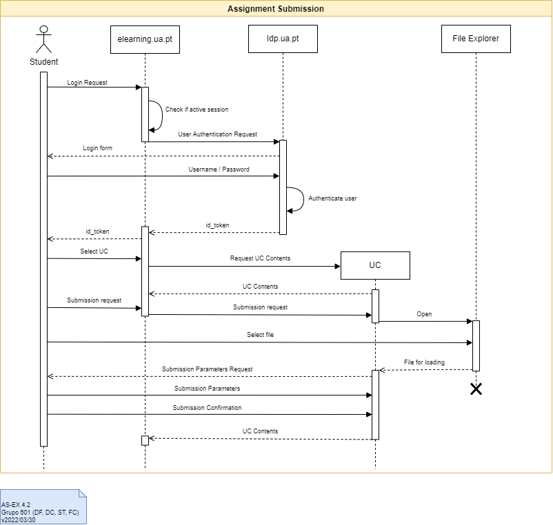
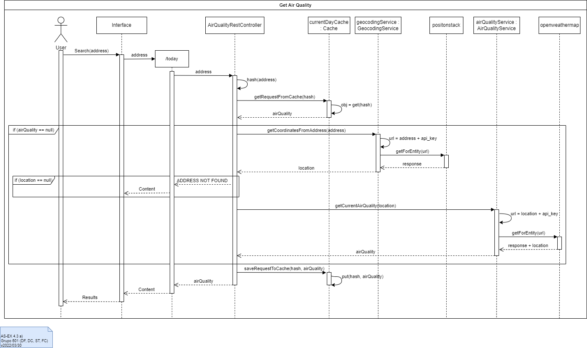
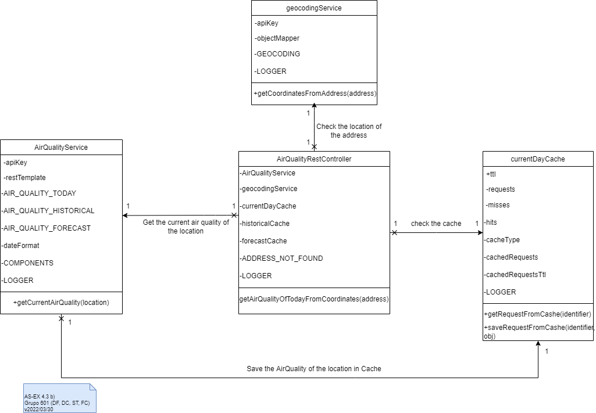
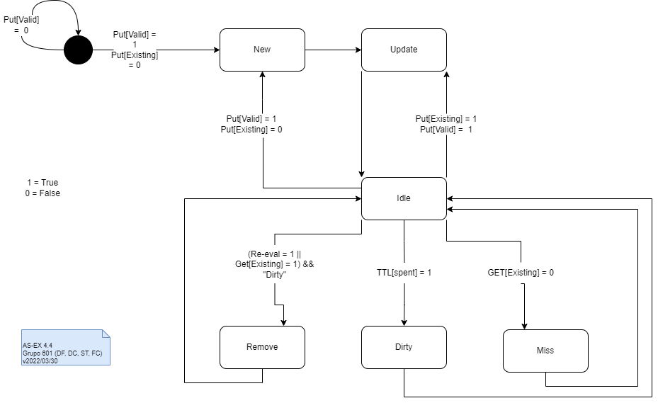

# Lab 04 - Modelação de interações

## Grupo - **601**

| Membros | Número Mecanográfico |
| :- | :-: |
| <u>Daniel Capitão</u> | 75943 |
| David Ferreira | 93444 |
| Samuel Teixeira | 103325 |
| Filipe Costa | 77548 |

## Exercício 4.1

A interação descrita na modelação refere-se ao processo de pagamento através do serviço de Apple Pay; esta interação é composta por **um ator** que é o utilizador, e por **cinco objetos**.

A interação é iniciada pelo ator aquando do pedido de checkout que é rececionado pela *IOS Application*, isto irá gerar um **pedido de pagamento** que por sua vez será pedido por este objeto ao *PassKit View Controller*, este objeto gera um **pedido de autorização** de pagamento ao actor assim como a confirmação dos endereços de faturação e de envio, o ator poderá agora optar por confirmar os dados e o pedido de autorização.

Se aprovado, o objeto *PassKit View Controller* irá recolher os dados de pagamento que já possui, e com estes **gera um *Apple* token** que será utilizado para pedir ao *Apple Server*, que após encriptado por este associando-lhe a identificação do comerciando, responde com um **token encriptado** que identifica esta transação. Este token por sua vez é retransmitido do *PassKit View Controller* para a *IOS Application*.

Após receber este token, a *IOS Application* irá comunicar diretamente com o *Payment Service* enviando-lhe um **pedido de autenticação do cartão de crédito/débito**. Ao receber este pedido, o *Payment Service* irá iniciar um processo de autenticação que se decompõe nas seguintes fases:
1. Transformação do pedido,
2. Desencriptação da informação do token.
3. Criação de um pedido de pagamento a ser enviado para a *Gateway*, ao que esta irá enviar uma **resposta**,
4. Tranformação da resposta.

Após estas fase, o *Payment Service* irá finalmente responde a *IOS Application* com uma resposta à autenticação do cartão de crédito/débito.

## Exercício 4.2

## Exercício 4.3

### a)

### b)

## Exercício 4.4

