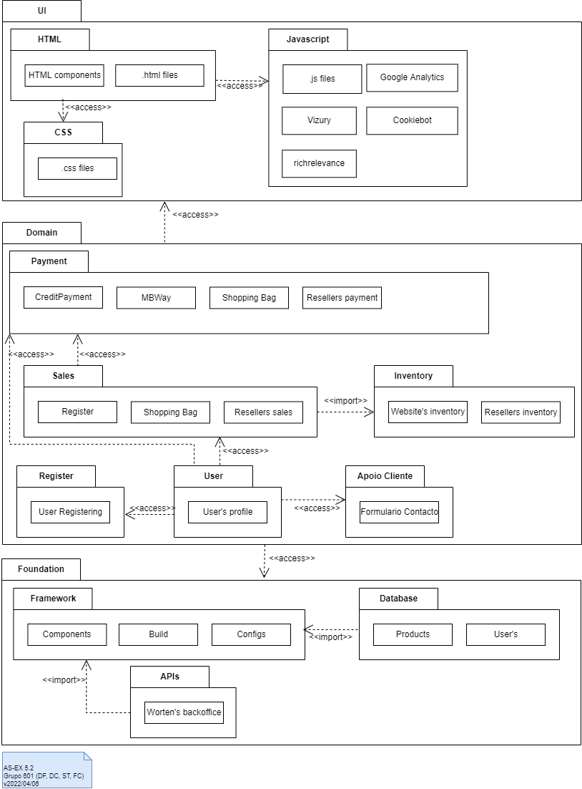

# Lab 05 - Architecture of Views

## Grupo - **601**

| Membros | Número Mecanográfico |
| :- | :-: |
| Daniel Capitão | 75943 |
| <u>David Ferreira</u> | 93444 |
| Samuel Teixeira | 103325 |
| Filipe Costa | 77548 |

## Exercício 5.1
### a)
The displayed diagram shows us a simplified view of a few component that we might encounter in Blogging services.

There are four components three of which expose interfaces to other components. The *BlogDataSource* which probably maintains the all the blogs information will require an external **logging** component which will be responsible for the authentication, for that the component will require the interface ***Logger*** exposed by the component *Log4j*.

The next component is the *ConversionManagement*, this component, according with the Diagram 1, is responsible for managing the blog's post, and to do soo. it will require a interface to access the data source provided by the *BlogDataSoure* component. Once the information is handled, the component will expose to different interfaces to access this data.

One of this interfaces, *FeedProvider*, seems to provide a RSS feed soo the Blog posts are accessible via any RSS Feed reader (ex: Feedly), this interface will be required by the ***BrodcastEngine*** which will probably be responsible to propagate this RSS feed.

The second interface, *DisplayConverter*, seems to make this blog post accessible in a somewhat normal text format, which the component ***BlogViewer*** will require in order to, probably, post the blog's content into the blog's website.

### b)

The Apache Log4j component is a Java-based utility for logging. What is does in a "plugin" type utility for an external service to use for user authentication into the system, this is practical in the sense that the developer does not need to create a new authentication scheme from zero and just implements this module to the project.

<div style="page-break-after: always;"></div>

### c)

```h
//
https://mvnrepository.com/artifact/org.apache.logging.log4j/log4j-core
implementation group: 'org.apache.logging.log4j', name: 'log4j-core', version: '2.17.2'
````

## Exercício 5.2
### a)

Upon researching we found a convincing example in [Packt Hub](https://hub.packtpub.com/what-is-multi-layered-software-architecture/) of a possible e-commerce application that implements a multi layered architecture, and we will base our approach on that.

Taking the example given, we can apply it for e-commerce website like [Worten.pt](https://www.worten.pt/) assuming it works in the same manner.

We assume a three layered structure: GUI, Domain and Foundation.

- **GUI**
    
    When looking at Worten's website it is obviously composed of modules of HTML, CSS and Javascript. When we analyze more carefully the GUI we can see that ir also integrates external services's scripts, namely from: Google Analytics, Vizury, Cookiebot, richrelevance.

- **Domain**

    Because Worten is a "marketplace type" website, that no only sells it's own products but it acts as a middle man for other resellers. For that the **Domain** need be able to handle Sales (self and for resellers), pricing, inventory, API for resellers, payments, ranking system, among other capabilities.

- **Foundation**

    This includes the framework the website is built upon (maybe PHP, Vue, React, or others), the databases (user, products, page contents, ...), webservices, and any other systems.

<div style="page-break-after: always;"></div>

### b)



<div style="page-break-after: always;"></div>

## Exercício 5.3

### a)


<div style="page-break-after: always;"></div>

### b)

