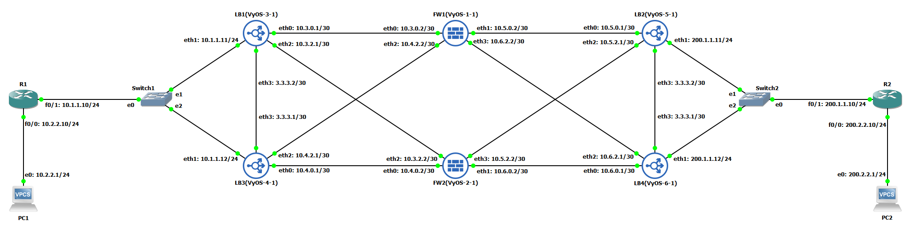
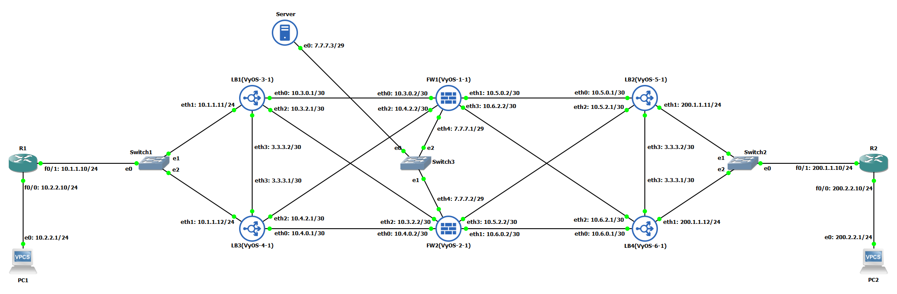
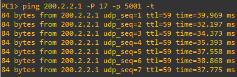
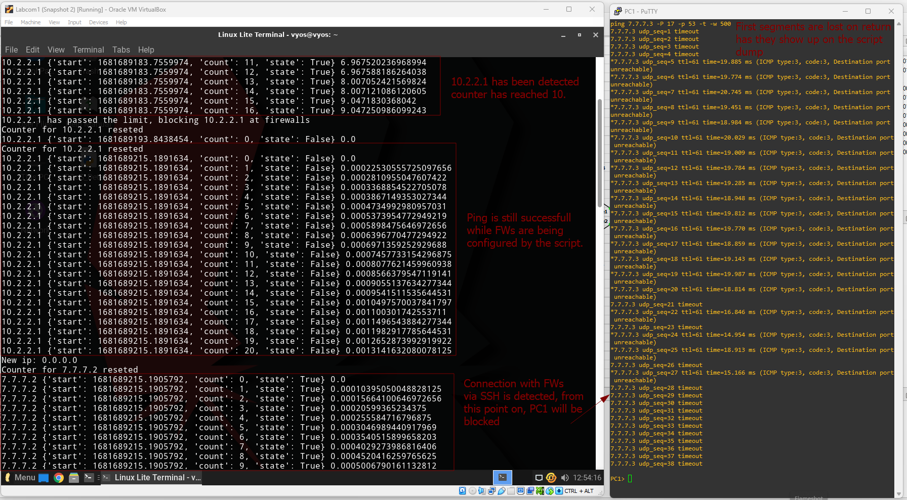

# Lab 04&emsp;High-Availability Firewalls Scenarios

## Students

- 93444&emsp;David José Araújo Ferreira

# Exercise 9

<p align="center">
  
</p>

## Load-balancers synchronization

Since all the traffic has to pass through load-balancers before it reaches the firewall and the internal and target network, by using VRRP and because each load-balancer is connected to both firewalls, if the master load-balancer stops sending *keep-alive* messages, the other with take over the virtual address and the traffic will then be handled by the *backup* load-balance. This also means that in case of the firewalls use NAT/PAT, the **load-balancers direct the traffic to the corresponding firewall that translated the *IP*** thus overcoming the need for the firewalls to synchronize their NAT/PAT translation tables.

## Load-balancing algorithms

**IP Hash** algorithm distributes traffic across multiple servers based on a hashing function that uses the client's IP address. In this algorithm, the hash function takes the **client's IP address as input** and produces a value that is used to **determine which server** the traffic should be directed to.

This **does not require** load balancer **synchronization** because each client's **traffic is consistently directed to the same server based on the hash value of their IP address**. As long as the hashing function is consistent across all servers, the load will be balanced evenly without the need for synchronization.

## State Synchronization during a DDoS Attack

During a DDoS attack, the network bandwidth and services capacity of response will be severely affected due to the massive incoming traffic. By keeping connections synchronized, if a particular device is under load, **benign traffic can be serviced by other available devices and thus keeping some QoS for the users**.

<div style="page-break-after: always;"></div>

Still, it can happen that all of the devices are under attack, if this is the case, synchronization is also a bonus if the administration of the network needs to **implement restriction policies** like IP, Port or *packet _type_ blocking throughout the entire network. This will **facilitate the **propagation of **these** measures** to all devices affected.

There is an obstacle however, in the same way, policies are propagated, also the traffic is, and when a large amount of traffic hits the network, it can be distributed through the entirety of the devices, which can cause the whole network to collapse instead of just specific devices. This is why the need for an ***intelligent* load-balancing system** can be fundamental to exclude and re-route potentially dangerous traffic instead of spreading its load.

<div style="page-break-after: always;"></div>

# Exercise 10

<p align="center">
  
</p>

For this scenario, the machine in the DMZ zone is imagined to be a typical web and SMTP server, holding the website and the email of a company. Because of this and since a *zero-trust* policy is desirable on the firewall front, three firewall policies were established.

## Firewalls

### DMZ-RES

Filters the traffic **from the Internal to the DMZ**, and only allows connections to ports *21, 22, 53 and 443* typically used for FTP, SSH, DNS and HTTPS respectively. These connections can be in TCP or UDP.


```console
name DMZ-RES {
  default-action drop
  rule 10 {
    action accept
    destination {
      port 22,443,21,53
    }
    protocol udp
  }
  rule 11 {
    action accept
    destination {
      port 22,443,21,53
    }
    protocol tcp
  }
}
```

<div style="page-break-after: always;"></div>

### DMZ-EXC

Filters incoming traffic **from outside to the DMZ** and it only allows for *HTTPS and domain* service ports, also in either TCP or UDP.

```console
name DMZ-EXC {
  default-action drop
  rule 10 {
    action accept
    destination {
      port https,domain
    }
    protocol udp
  }
  rule 11 {
    action accept
    destination {
      port https,domain
    }
    protocol tcp
  }
}
```

### DMZ-OUT

This firewall deals with traffic **from the DMZ to anywhere**, since the incoming is already controlled and it is not expected for the server in the DMZ to do anything else than respond to requests, the rule defines that **only responses to established sessions** are allowed.

```console
name DMZ-OUT {
  default-action drop
  rule 10 {
    action accept
    state {
      established enable
      related enable
    }
  }
}
```

<div style="page-break-after: always;"></div>

## Monitoring and reactivity to attack

The following code uses *tcpdump* to capture the incoming traffics, and build a database of detected IP, each one associated with a *timestamp* of its last counter reset and the number of times packet of this IP have been detected. If an IP tries to transmit more than 10 packet every 10 seconds, it will be blocked. This is done by communicating to the Firewalls the IP to include in the exclusion list. This communication is done via the *Netmiko* API.

```Python
import subprocess as sub
import time, re
from netmiko import ConnectHandler

firewalls = [{ "host": "vyos", "addr": "7.7.7.1", "pass": "vyos"}, { "host": "vyos", "addr": "7.7.7.2", "pass": "vyos"}]
ips = {}

def block_ip(ip):
  for fwl in firewalls:
    vyos_router = {"device_type": "vyos", "host":fwl["addr"], "username":fwl["host"], "password":fwl["pass"], "port": 22, }
    net_connect = ConnectHandler(**vyos_router)
    #Exclusion policy for services
    config_commands = [
      f'set firewall name DMZ-EXC rule 10 source address !{ip}',
      f'set firewall name DMZ-EXC rule 11 source address !{ip}',
      f'set firewall name DMZ-RES rule 10 source address !{ip}',
      f'set firewall name DMZ-RES rule 11 source address !{ip}',
    ]
    net_connect.send_config_set(config_commands, exit_config_mode=False)
    net_connect.commit()

p = sub.Popen(('sudo', 'tcpdump', '-l', '-i', 'enp0s3'), stdout=sub.PIPE)
for row in iter(p.stdout.readline,b''):
  line = str(row.rstrip())
  ip = None
  now = time.time()
  try:
    ip_regex = re.compile("( [0-9]+[.][0-9]+[.][0-9]+[.][0-9]+)")
    ip = ip_regex.findall(line)[0][1:]
  except Exception as e:
    continue
  if ip and ip not in ips.keys():
    print(f"New ip: {ip}")
    ips[ip]={"start": now,"count": 1,"state": True}
  elif ip:
    # Verifies if IP has appeared in the last 10 seconds
    if now - ips[ip]["start"] >= 10:  
      # If the IP has appeared more then 10 times in the last 10 seconds, it gets blocked   
      if ips[ip]["count"] >= 10 and ip not in list(map(lambda x: x["addr"], firewalls)):
        print(f"{ip} has passed the limit, blocking {ip} at firewalls")
        ips[ip]["state"] = False
        block_ip(ip)
      # Counter is reseted
      print(f"Counter for {ip} reseted")
      ips[ip]["start"] = now
      ips[ip]["count"] = 0
    else:
      ips[ip]["count"] = ips[ip]["count"] + 1
    print(ip, ips[ip], now - ips[ip]["start"] )
```

### Testing

To test this functionality follow this steps:

1. In the VM used as a DMZ server, configure it's IP something like `7.7.7.3` and the default gateway as `7.7.7.1`.
2. Install *Netmiko* using `pip install netmiko`.
3. Back on the DMZ VM now, run the script with elevated privileges.
4. In the PC1 run the command `ping 7.7.7.3 -p 53 -P 17 -t`.

Now observe the console in PC1 and soon, it will stop being able to reach the server.

<div style="page-break-after: always;"></div>

# Annexes

Configurations of devices are available in `.txt` files in the same `.zip` has this report.

## Ping from Inside to Outside

<p align="center">
  
</p>

## DDoS Detection and blocking

<p align="center">
  
</p>
