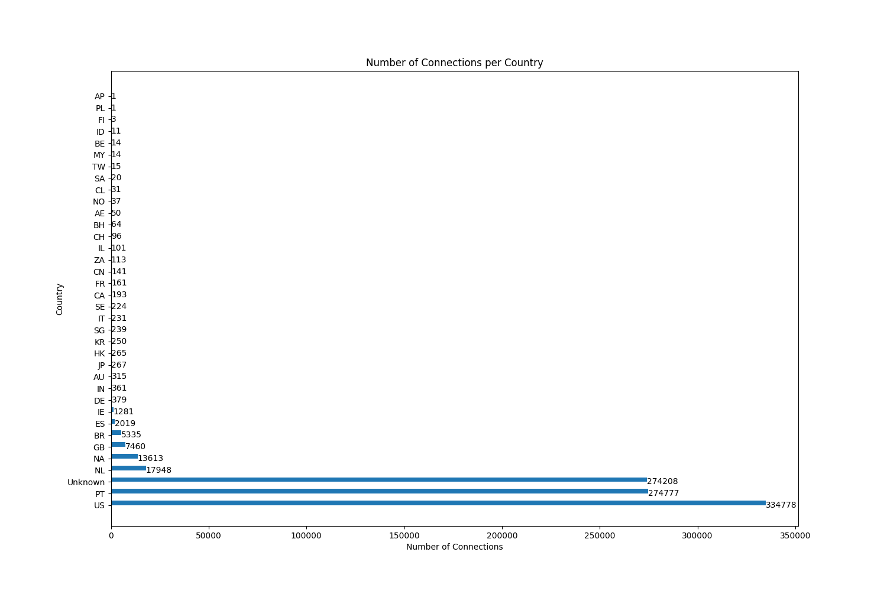
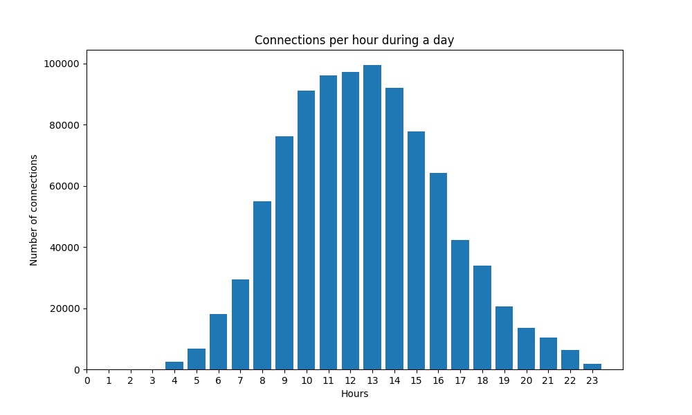

# Sentinel traffic report

This report was automatically generated at **2023-06-25 21:01:06.788283** by the **Sentinel** service.

# Connection volume by country

The correlation between connection volume and country of destination can be viewed in the graphic bellow.

# Connection volume per hour

This graph ilustrates the number of connection per hour during a day

# Alerts Detected

### Alert - nº 0

Traffic generated by a possible **exfiltration**.

#### Details

| IP Address | Origin | DNS name |
| - | - | - |
| 192.168.104.200 | Unknown | Unknown |

Flow shows a ratio of downloaded bytes over uploaded bytes above the **90 percentile** for downloads over uploads in this session.

| Downloaded bytes | Uploaded bytes |
| - | - |
| 14778895 | 1415961 |

### Alert - nº 1

Traffic generated by a possible **exfiltration**.

#### Details

| IP Address | Origin | DNS name |
| - | - | - |
| 192.168.104.206 | Unknown | Unknown |

Flow shows a ratio of downloaded bytes over uploaded bytes above the **90 percentile** for downloads over uploads in this session.

| Downloaded bytes | Uploaded bytes |
| - | - |
| 53495023 | 5195056 |

### Alert - nº 2

Traffic generated by a possible **exfiltration**.

#### Details

| IP Address | Origin | DNS name |
| - | - | - |
| 192.168.104.159 | Unknown | Unknown |

Flow shows a ratio of downloaded bytes over uploaded bytes above the **90 percentile** for downloads over uploads in this session.

| Downloaded bytes | Uploaded bytes |
| - | - |
| 324226107 | 32356733 |

### Alert - nº 3

Traffic generated by a possible **exfiltration**.

#### Details

| IP Address | Origin | DNS name |
| - | - | - |
| 192.168.104.44 | Unknown | Unknown |

Flow shows a ratio of downloaded bytes over uploaded bytes above the **90 percentile** for downloads over uploads in this session.

| Downloaded bytes | Uploaded bytes |
| - | - |
| 98180581 | 9977423 |

### Alert - nº 4

Traffic generated by a possible **exfiltration**.

#### Details

| IP Address | Origin | DNS name |
| - | - | - |
| 192.168.104.31 | Unknown | Unknown |

Flow shows a ratio of downloaded bytes over uploaded bytes above the **90 percentile** for downloads over uploads in this session.

| Downloaded bytes | Uploaded bytes |
| - | - |
| 259857369 | 26500446 |

### Alert - nº 5

Traffic generated by a possible **exfiltration**.

#### Details

| IP Address | Origin | DNS name |
| - | - | - |
| 192.168.104.74 | Unknown | Unknown |

Flow shows a ratio of downloaded bytes over uploaded bytes above the **90 percentile** for downloads over uploads in this session.

| Downloaded bytes | Uploaded bytes |
| - | - |
| 385717683 | 39392101 |

### Alert - nº 6

Traffic generated by a possible **exfiltration**.

#### Details

| IP Address | Origin | DNS name |
| - | - | - |
| 192.168.104.84 | Unknown | Unknown |

Flow shows a ratio of downloaded bytes over uploaded bytes above the **90 percentile** for downloads over uploads in this session.

| Downloaded bytes | Uploaded bytes |
| - | - |
| 193031076 | 19880947 |

### Alert - nº 7

Traffic generated by a possible **exfiltration**.

#### Details

| IP Address | Origin | DNS name |
| - | - | - |
| 192.168.104.182 | Unknown | Unknown |

Flow shows a ratio of downloaded bytes over uploaded bytes above the **90 percentile** for downloads over uploads in this session.

| Downloaded bytes | Uploaded bytes |
| - | - |
| 609527835 | 63089225 |

### Alert - nº 8

Traffic generated by a possible **exfiltration**.

#### Details

| IP Address | Origin | DNS name |
| - | - | - |
| 192.168.104.61 | Unknown | Unknown |

Flow shows a ratio of downloaded bytes over uploaded bytes above the **90 percentile** for downloads over uploads in this session.

| Downloaded bytes | Uploaded bytes |
| - | - |
| 180286154 | 18757183 |

### Alert - nº 9

Traffic generated by a possible **exfiltration**.

#### Details

| IP Address | Origin | DNS name |
| - | - | - |
| 192.168.104.48 | Unknown | Unknown |

Flow shows a ratio of downloaded bytes over uploaded bytes above the **90 percentile** for downloads over uploads in this session.

| Downloaded bytes | Uploaded bytes |
| - | - |
| 119473876 | 12433702 |

### Alert - nº 10

Traffic generated by a possible **exfiltration**.

#### Details

| IP Address | Origin | DNS name |
| - | - | - |
| 192.168.104.196 | Unknown | Unknown |

Flow shows a ratio of downloaded bytes over uploaded bytes above the **90 percentile** for downloads over uploads in this session.

| Downloaded bytes | Uploaded bytes |
| - | - |
| 171209567 | 17843063 |

### Alert - nº 11

Traffic generated by a possible **exfiltration**.

#### Details

| IP Address | Origin | DNS name |
| - | - | - |
| 192.168.104.80 | Unknown | Unknown |

Flow shows a ratio of downloaded bytes over uploaded bytes above the **90 percentile** for downloads over uploads in this session.

| Downloaded bytes | Uploaded bytes |
| - | - |
| 451710050 | 47183733 |

### Alert - nº 12

Traffic generated by a possible **exfiltration**.

#### Details

| IP Address | Origin | DNS name |
| - | - | - |
| 192.168.104.39 | Unknown | Unknown |

Flow shows a ratio of downloaded bytes over uploaded bytes above the **90 percentile** for downloads over uploads in this session.

| Downloaded bytes | Uploaded bytes |
| - | - |
| 342444522 | 35770433 |

### Alert - nº 13

Traffic generated by a possible **exfiltration**.

#### Details

| IP Address | Origin | DNS name |
| - | - | - |
| 192.168.104.86 | Unknown | Unknown |

Flow shows a ratio of downloaded bytes over uploaded bytes above the **90 percentile** for downloads over uploads in this session.

| Downloaded bytes | Uploaded bytes |
| - | - |
| 454187871 | 47468009 |

### Alert - nº 14

Traffic generated by a possible **exfiltration**.

#### Details

| IP Address | Origin | DNS name |
| - | - | - |
| 192.168.104.15 | Unknown | Unknown |

Flow shows a ratio of downloaded bytes over uploaded bytes above the **90 percentile** for downloads over uploads in this session.

| Downloaded bytes | Uploaded bytes |
| - | - |
| 270917065 | 28330074 |

### Alert - nº 15

Traffic generated by a possible **exfiltration**.

#### Details

| IP Address | Origin | DNS name |
| - | - | - |
| 192.168.104.96 | Unknown | Unknown |

Flow shows a ratio of downloaded bytes over uploaded bytes above the **90 percentile** for downloads over uploads in this session.

| Downloaded bytes | Uploaded bytes |
| - | - |
| 410205007 | 42922223 |

### Alert - nº 16

Traffic generated by a possible **exfiltration**.

#### Details

| IP Address | Origin | DNS name |
| - | - | - |
| 192.168.104.210 | Unknown | Unknown |

Flow shows a ratio of downloaded bytes over uploaded bytes above the **90 percentile** for downloads over uploads in this session.

| Downloaded bytes | Uploaded bytes |
| - | - |
| 227739990 | 23856747 |

### Alert - nº 17

Traffic generated by a possible **exfiltration**.

#### Details

| IP Address | Origin | DNS name |
| - | - | - |
| 192.168.104.14 | Unknown | Unknown |

Flow shows a ratio of downloaded bytes over uploaded bytes above the **90 percentile** for downloads over uploads in this session.

| Downloaded bytes | Uploaded bytes |
| - | - |
| 493350116 | 51688074 |

### Alert - nº 18

Traffic generated by a possible **exfiltration**.

#### Details

| IP Address | Origin | DNS name |
| - | - | - |
| 192.168.104.98 | Unknown | Unknown |

Flow shows a ratio of downloaded bytes over uploaded bytes above the **90 percentile** for downloads over uploads in this session.

| Downloaded bytes | Uploaded bytes |
| - | - |
| 291560827 | 30572242 |

### Alert - nº 19

Traffic generated by a possible **botnet**.

#### Details

| IP Address | Origin | DNS name |
| - | - | - |
| 192.168.104.224 | Unknown | Unknown |

Flows between internal host to common destinations in the same subnet, may indicate the existance of a internal botnet.

| Subnet | Rate of communications (per second) | Number of peers in the network |
| - | - | - |
| 192.168.104.0/24 | 0.0081 | 199 |

### Alert - nº 20

Traffic generated by a possible **botnet**.

#### Details

| IP Address | Origin | DNS name |
| - | - | - |
| 192.168.104.231 | Unknown | Unknown |

Flows between internal host to common destinations in the same subnet, may indicate the existance of a internal botnet.

| Subnet | Rate of communications (per second) | Number of peers in the network |
| - | - | - |
| 192.168.104.0/24 | 0.0079 | 199 |

### Alert - nº 21

Traffic generated by a possible **botnet**.

#### Details

| IP Address | Origin | DNS name |
| - | - | - |
| 192.168.104.230 | Unknown | Unknown |

Flows between internal host to common destinations in the same subnet, may indicate the existance of a internal botnet.

| Subnet | Rate of communications (per second) | Number of peers in the network |
| - | - | - |
| 192.168.104.0/24 | 0.0059 | 199 |

### Alert - nº 22

Traffic generated by a possible **botnet**.

#### Details

| IP Address | Origin | DNS name |
| - | - | - |
| 192.168.104.234 | Unknown | Unknown |

Flows between internal host to common destinations in the same subnet, may indicate the existance of a internal botnet.

| Subnet | Rate of communications (per second) | Number of peers in the network |
| - | - | - |
| 192.168.104.0/24 | 0.0059 | 199 |

### Alert - nº 23

Traffic generated by a possible **botnet**.

#### Details

| IP Address | Origin | DNS name |
| - | - | - |
| 192.168.104.222 | Unknown | Unknown |

Flows between internal host to common destinations in the same subnet, may indicate the existance of a internal botnet.

| Subnet | Rate of communications (per second) | Number of peers in the network |
| - | - | - |
| 192.168.104.0/24 | 0.0058 | 199 |

### Alert - nº 24

Traffic generated by a possible **botnet**.

#### Details

| IP Address | Origin | DNS name |
| - | - | - |
| 192.168.104.232 | Unknown | Unknown |

Flows between internal host to common destinations in the same subnet, may indicate the existance of a internal botnet.

| Subnet | Rate of communications (per second) | Number of peers in the network |
| - | - | - |
| 192.168.104.0/24 | 0.0057 | 199 |

